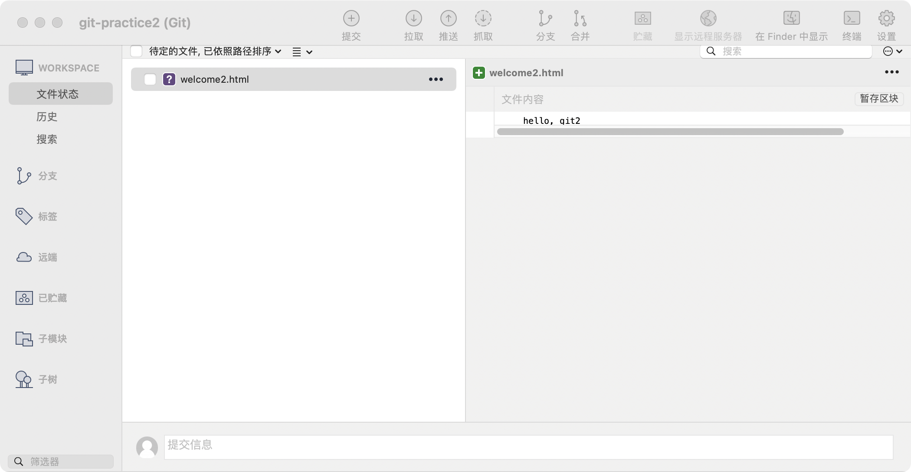

#                                                                                                                 Git学习笔记2022 -liupeiyao

参考学习资料：《Git从入门到精通》高见龙著

# 第一章 Git

**Git**: 一种version control system——一种分布式版本的版本控制系统。（像打游戏存储进度一样，每次都记录）

目的：整理备份文件，保留历史记录和证据。

特点：

> 不是记录版本差异，而是记录文件内容的"快照（snapshot）"。
>
> 是分布式系统（Distributed Version Control)，对应CVS或SVN之类的集中式版控系统（需要一台专业服务器）。
>
> 没有服务器和网络仍可以使用Git进行版控


# 第二章 环境安装

macOS系统安装Git有两种方法：

> - 官方网站
> - **Homebrew**软件安装Git

Linux系统安装Git：

> ```bash
> $ apt-get install git
> ```
>
> 可能出现"are you root?” 的报错，需要使用`sudo`指令来临时提高权限，完成安装。
>
> ```bash
> $ sudo apt-get install git
> ```

Graphic User interface

> MacOS: 推荐SourceTree和GitHub Desktop
>
> Linux：gitk软件
>
> ```bash
> $ sudo apt-get install gitk
> ```


# 第三章 终端机/命令提示符

```bash
# 文件列表 ls命令
$ ls -al # a显示包括.*的文件，l完整权限和所有者，创建及修改的时间
$ touch index.html 创建一个名为index.html的文件
```

还有`cp`、`mv`、`rm`、`rm`等命令，省略不做解释。

**Vim**是Git的默认编辑器，Vim有两种模式：Normal和Insert模式。

Vim的操作:

> Normal模式下输入`i/a/o`进入Insert模式；Insert模式下按下`Esc`键可退回Normal模式；
>
> Normal模式下，按下`:w`将对文件进行存储，`:q`则是关闭文件；`:wq`储存完成后直接关闭文件。


# 第四章 设置Git

## 4.1 用户设置

首先要设置用户E-mail和用户名。在终端中键入：

> config：计算机系统配置

```bash
$ git config --global user.name "Amy"  #--global参数是进行全局设置
$ git config --global user.email "Amy@abc.com"
# 如果安装了GUI软件
$ git config --list 
credential.helper=osxkeychain
user.name=Amy
user.email=Amy@abc.com
```

不论是终端机命令还是GUI中完成的设置，所有Git相关的设置都默认保存在自己账号下的**`.gitconfig`**文件中，使用一般的文字编辑器修改此文件，也会有效果。

`-- global`参数进行全局设置，针对特定的项目，若是要设置不同的作者，只需要切换成`--local`。

例如：

```bash
$ git config --local user.name "Mike"
$ git config --local user.name "Mike@123.com"
```

## 4.2 其他设置

**更换编辑器**

```bash
$ git config --global core.editor emacs
```

也可以使用vscode等文字编辑器。

**设置缩写**

```bash
$ git config --global alias.co checkout   # 将checkout缩写为co
$ git config --global alias.st status     # 将status缩写为st
```

设置缩写后，使用`git co`命令和使用`git checkout`是一样的，同理`git st`。

```bash
# 还能使用Alias缩写更长的含有参数的命令
$ git config -- global alias.l "log --oneline --graph"
```

设置完成后`git l`命令和原来的长命令效果一样了。查看log时候可以把commit的人和时间都加上去：

```bash
$ git config --global alias.ls 'log --graph --pretty=format:"%h <%an> %ar %s"'
# format参数用于输出commit的个别信息
```

这些Alias（别名）设置都可以直接到`～/.gitconfig`中修改


# 第五章 开始使用Git

## 5.1 新增及初始Repository（仓库）

第一次使用Git：

```bash
# 创建一个全新的目录
$ cd /tmp           # 切换至/tmp目录
$ mkdir git-practice
$ cd git-practice/
$ git init          # 初始化这个目录，让Git对这个目录进行版本控制
hint: Using 'master' as the name for the initial branch. This default branch name
hint: is subject to change. To configure the initial branch name to use in all
hint: of your new repositories, which will suppress this warning, call:
hint: 
hint: 	git config --global init.defaultBranch <name>
hint: 
hint: Names commonly chosen instead of 'master' are 'main', 'trunk' and
hint: 'development'. The just-created branch can be renamed via this command:
hint: 
hint: 	git branch -m <name>
Initialized empty Git repository in /private/tmp/git-practice/.git/
```

`git init`命令会创建一个`.git`目录。

>  （注意：小数点开头的文件或目录名称可能会隐藏，需要开启检视隐藏文档之类的设置才能看到）。

在GUI软件如SourceTree中可以执行：*<u>New→Create local Repository</u>*（创建本地仓库)的操作。在弹出窗口输入路径，设置类型为Git

如果对本来就存在的目录进行版本控制，在那个目录下执行`git init`命令即可，在GUI中直接拖拽能得到同样的效果。

Git都是靠`.git`目录在做事，如果这个目录不想被版本控制，只需要移除`.git`目录，Git就对这个目录失去控制权了。

> 笔记中根据参考书是指导的都是使用的/tmp目录。
>
> /tmp目录在macOS系统下，在下次计算机重启的时候会被全部清除，减少了手动清理的麻烦。

## 5.2 把文件交给Git

**1⃣️第一步：创建文件**

```bash
# 在“git- practice“中使用Git管理这个目录
$ git status
On branch master

No commits yet

nothing to commit (create/copy files and use "git add" to track)  
# 在这个目录中除了Git生成的.Git隐藏目录外什么都没有
# 显示隐藏文件
$ ls -al
total 0
drwxrwxr-x   3 Amy  wheel    96  2 11 20:45 .
drwxrwxrwt  44 root       wheel  1408  2 11 20:45 ..
drwxrwxr-x   9 Amy  wheel   288  2 11 20:45 .git # Git产生的隐藏文件
# 接下来在“git- practice”中创建一个内容为“hello git”的文件，并命名为～：
$ echo "hello, git" > welcome.html
$ git status  # 再次使用git status命令
On branch master

No commits yet

Untracked files:      # 这个welcome.html文件还是"未追踪到状态"，还未加到Git版控系统
  (use "git add <file>..." to include in what will be committed)
	welcome.html

nothing added to commit but untracked files present (use "git add" to track)
```

下图是在SourceTree中 查看的测试结果（/tmp/git-prcatice2）

**2⃣️第二步：让Git“追踪”文件**

**`git add`**命令：

```bash
$ git add welcome.html # 就可以将文件交给git管控了
$ git status
On branch master

No commits yet

Changes to be committed:
  (use "git rm --cached <file>..." to unstage)
	new file:   welcome.html   # untracked文件变成了new file
```

在SourceTree工具中，右键选择”添加到索引（Add to index)能达到相同的效果。（这里Index为“下标”，同下文staging area）

经过`add`命令该文件就被安置到暂存区域（Staging Area/Index)，之后将与其他文件一起被存储到存储库中。

技巧：

```bash
$ git add *.html # 一次加多个后缀名相同的文件
$ git add --all. # 把全部文件加到index
```

**问：如果在`git add`之后改动了文件内容怎么办？**

这里复习上面的内容，重建一个目录及文件：

```bash
$ mkdir git-abc-practice # 第一步：创建目录
$ cd git-abc-practice/   # 第二步：转到目录
$ git init               # 第三步：初始化目录，创建.git文件
hint: Using 'master' as the name for the initial branch. This default branch name
hint: is subject to change. To configure the initial branch name to use in all
hint: of your new repositories, which will suppress this warning, call:
hint: 
hint: 	git config --global init.defaultBranch <name>
hint: 
hint: Names commonly chosen instead of 'master' are 'main', 'trunk' and
hint: 'development'. The just-created branch can be renamed via this command:
hint: 
hint: 	git branch -m <name>
Initialized empty Git repository in /private/tmp/git-abc-practice/.git/
$ git status              # 查看状态
On branch master

No commits yet     

nothing to commit (create/copy files and use "git add" to track) # 显示没有提交
$ echo "1234567890" > git-abc.txt 
$ git status  
On branch master

No commits yet

Changes to be committed:
  (use "git rm --cached <file>..." to unstage)
	new file:   git-abc.txt
	# 接下来我们对试验文件进行改动，模拟git add之后文件内容发生变化的情节
$ vi git-abc.txt
$ head git-abc.txt
88888888
$ git status
On branch master

No commits yet

Changes to be committed:
  (use "git rm --cached <file>..." to unstage)
	new file:   git-abc.txt      # 这里是git add加到index/staging area的最初文件

Changes not staged for commit:
  (use "git add <file>..." to update what will be committed)
  (use "git restore <file>..." to discard changes in working directory)
	modified:   git-abc.txt      # 可以发现这里变成了两个 git-abc.txt文件
```

在上面的案例中，试验中的文件变成了两个。第一次add后的文件加入了staging area，但加入后编辑改动的内容没有再次被加入staging area，且此时staging area中的数据仍然是初次add进来后的文件。如果我们需要改动后的内容，只需要再次执行add命令，把新版本加入staging area：`git add git-abc.txt`。

**`git add`参数：“`--al`”和“`.`“**

`git add`有两个参数：“`--al`”及“``.``"，这两个参数在执行命令时时的表现有所差异。

> 版本：在version 2.x之后，两个参数在“删除文件”的行为上没有什么区别了。
>
> 执行命令时候的目录位置：
>
> - `git add .`：把当前目录及其子目录、子子目录......中的异动全add到staging area，目录以外不执行。
> - `git add --al`：不论在哪一层目录执行，效果一样，该项目中的所有异动均会被add到staging area。


**3⃣️第三步：把暂存库（Staging Area）中的内容提交到存储库（Repository）里存档**

为了使staging area中的内容永久保存下来，需要使用**`git commit`**命令：

```shell
# 回到第二步的案例中
$ cd git-practice
$ git commit -m "init commit"     # -m 说明本次commit“做了什么事情？”
[master (root-commit) a1b003f] init commit
 1 file changed, 1 insertion(+)
 create mode 100644 welcome.html
```

在SourceTree中的实现：点击左上角“*<u>提交</u>*”按钮，然后输入信息，然后单击右下角“提交”，就完成了一次commit。


**回顾**

> 第一步：init初始化目录，创建文件
>
> 第二步：add 使得“Git“追踪文件
>
> 第三步：commit 存档，创建版本完成


**注意事项**：

⚠️： Git的每次Commit只会处理Staging Area中的内容，没有存入Staging Area 的文件不会被提交到Repository。

⚠️：Commit文件时，如果没有输入信息（-m），Git默认不会完成此次提交。

**空Commit**

在以往的资料中，之前的Git版本不一定要有内容才能Commit，只要加上参数`--allow-empty`，没有内容也可以Commit。实践时发现：

```bash
$ git commit --allow-empty -m ""
Aborting commit due to empty commit message.  # 不再允许提交空内容
```


## 5.3 工作区、暂存区与存储区

**两段式提交：**


对于已经存在于repository区域的文件，可以在commit时加一个`-a`参数，减少add的步骤：

```bash
$ git commit -a -m "information"   # 对于Untracked files无效
```

查看暂存区中的文件：

```shell
$ git ls-files
```


## 5.4 查看记录

查看Git记录：**`git log`**命令

```bash
$ ls   # 在当前工作目录下已经存在一个commit过的welcome.html文件
welcome.html
$ touch history-index.html # 在working dir中再创建一个新文件
$ ls
history-index.html welcome.html
$ git add history-index.html 
$ git commit -m "create index page" 
[master 0de0802] create index page
 1 file changed, 0 insertions(+), 0 deletions(-)
 create mode 100644 history-index.html
$ git log    # 查看Git记录
commit 0de08027a96fb7be3cbd3549fde299a97d2012c0 (HEAD -> master) # 越新的信息出现在越上面
Author: Pearl Liu <liupeiyao_1998@outlook.com>   # 本次commit的作者
Date:   Sat Feb 12 21:01:58 2022 +0800
   
   create index page
    
commit a1b003f40cf02443f7693d1ee6322b67d0df4a56   # 这里像乱码一样的是SHA-1算法计算的结果，作为每个commit的识别码
Author: Pearl Liu <liupeiyao_1998@outlook.com>
Date:   Sat Feb 12 20:16:34 2022 +0800

   init commit
# 加上额外参数可以让结果变得更美观简洁
$ git log --oneline --graph
* 0de0802 (HEAD -> master) create index page   # 对Git来说识别码的6~8码信息就足以识别了
* a1b003f init commit
```

在SourceTree中只需要选择WORKPACE→History就可以看到记录。

>
>
>
>
><u>*master*</u>是Git中默认的分支名称。空心圆圈表示HEAD的位置，HEAD指向现在这个分支最前端的位置。


**利用Git查询历史记录可以解决的问题**

> - 找某（些）人的Commit： `$ git log --oneline --author="Tom"`
>
> ​                                                     `$ git log --online --author="Tom\|Pearl"`("|"是“或”的意思)
>
> - 找Commit中是否含有某些关键字: `$ git log --oneline --grep="ABC"`
> - 在Commit中文件中找到Ruby：`$ git log -s "Ruby"`
> - 查找一段时间内的Commit：
>
> ​       举例：“从2022年1月之后，每天早上9点到下午5点之间的提交。”
>
> ​         `$ git log --oneline --since="9am" --until="5pm" --after="2022-01"`
>
> 以上这些在命令行中完成的事情，都可以在GUI中如SourceTree中的Search选项中完成。

## 5.5 在Git中删除文件、更改文件名

**删除文件**

- 系统命令直接删除——**`rm`**

  ```bash
  $ rm welcome.html
  $ git status
  On branch master
  Changes not staged for commit:   # “删除”没有被暂存
    (use "git add/rm <file>..." to update what will be committed)
    (use "git restore <file>..." to discard changes in working directory)
  	deleted:    welcome.html    # 显示被删除了
  
  no changes added to commit (use "git add" and/or "git commit -a")
  # 如果想要增加此次改动：
  git add welcome.html
  liupeiyaodeMacBook-Pro:git-practice liupeiyao$ git status
  On branch master
  Changes to be committed:
    (use "git restore --staged <file>..." to unstage)
  	deleted:    welcome.html
  # 可以把“删除”也当作一次改动
  ```

- Git删除——**`git rm`**

  ```bash
  $ git rm history-index.html 
  rm 'history-index.html'
  liupeiyaodeMacBook-Pro:git-practice liupeiyao$ git status
  On branch master
  Changes to be committed:   # 直接在暂存区了
    (use "git restore --staged <file>..." to unstage)
  	deleted:    history-index.html
  	deleted:    welcome.html
  ```

在SourceTree中*<u>Remove</u>*选项可以执行相同操作。

- 加上**` -- cached`**参数

  不论是执行`rm`命令，还是`git rm`命令，都会真的把这个文件从工作目录中删除。如果不想真的把文件删除，而只是不想让这个文件被Git控制了，可以加上`--cached`(隐藏）参数。

  ```shell
  $ git rm welcome --cached
  rm 'welcome.html'   # 文件会从Git目录中的tracked变成Untracked5.4 变更文件名
  ```

  

**更改文件名**

- 系统命令直接改名——**`mv`**

  ```shell
  $ mv hello.html world.html                
  ```

​        对于Git来说更改文件名，是两个操作：删除原文件，新增更名后文件。需要接着使用`git add`命令把改动加入Staging Area。

- GIt改名——**`git mv`**

  使用此命令可以减少`git add`操作；改名后使用`git status`查看文件状态，其状态已变成renamed。

- 在GUI工具如SourceTree中改名，需要在文件上右击，选择*<u>Move（移动）</u>*选项。

⚠️： Git是根据文件内容来计算**SHA-1**值，文件名称并不重要。

> 更改文件名时，Git不会为此做出一个新的Blob对象，而是指向原来的Blob对象。
>
> 但由于文件名发生变化，Git会做出一个新的Tree对象。

## 5.6 修改Commit记录

改动Commit记录的方式：

> 1. 删除整个.git目录（非常不建议，除非文件不重要）。
> 2. 使用`git rebase`命令来改动历史记录。
> 3. 先把Commit用`git reset `命令删除，整理后再重新Commit。
> 4. 使用`--amend`参数改动最后一次的Commit。

**使用`--amend`参数进行Commit**

```shell
# 案例：在Commit时输入了脏话，想要修改
$ touch WTF.html      
$ git add WTF.html    
$ git commit -m 'WTF!'  # 这里我们创建一次有“脏话”的commit
[master 2f0f383] WTF!
 1 file changed, 0 insertions(+), 0 deletions(-)
 create mode 100644 WTF.html
# 现在我们要修改commit，需要在commit后加上--amend参数（amend：修改）
$ git commit --amend -m 'Welcome!'  
[master e919516] Welcome!
 Date: Mon Feb 21 20:26:31 2022 +0800
 1 file changed, 0 insertions(+), 0 deletions(-)
 create mode 100644 WTF.html
 # 查看历史
 $ git log --oneline
 # 会弹出vim
```

> 补充：`git log`参数`--oneline`
>
> 使用 --oneline 参数，only one line !只显示提交的 SHA1 值（缩）和提交信息。

在SourceTree中，单击*<u>“提交”</u>*进入<u>*“提交”*</u>界面，在<u>“<u>*提交选项”*</u>中选择*<u>“修改上一次提交”</u>*，然后”提交“。


⚠️：Commit改动后，提交对象的时间和内容都没有改，但SHA-1值改变了，表示这是一次全新的提交！

**使用`rebase`命令来处理更早的记录**

⚠️：`--amend`参数只能处理最后一次Commit，改动更早的记录要使用**`rebase`**命令。

## 5.7 追加文件到最近一次的Commit

应用场景：刚刚Commit之后，发现有个文件忘了加上，不想再次commit。

解决方法：

> 1. 使用`git reset`命令把最后一次Commit删除，加上新文件后再重新Commit。
> 2. 使用--amend参数。

```shell
# 示例代码
$ touch cinderella.html  # 假设新出现了一个文件
$ git status
On branch master
Untracked files:
  (use "git add <file>..." to include in what will be committed)
	cinderella.html        # 可以看到新文件的状态是untracked

nothing added to commit but untracked files present (use "git add" to track)
$ git add cinderella.html 
$ git commit --amend --no-edit   # --no-edit 参数表示“我不编辑commit信息”，就不会跳出vim窗口
[master 751d4c6] Welcome!
 Date: Mon Feb 21 20:26:31 2022 +0800
 2 files changed, 0 insertions(+), 0 deletions(-)
 create mode 100644 WTF.html
 create mode 100644 cinderella.html  # 可以看到已经加入了
```

在SourceTree中，先把“新文件”加入暂存区然后：提交→提交选项→修改上次提交。

⚠️：尽量不要在已经Push出去的Commit上改动历史记录。

## 5.8 新增目录

应用场景：新增的目录好像无法加入Git中？——**`.keep`**&**`.gitkeep`**

```shell
# 案例
$ git status
On branch master
nothing to commit, working tree clean
$ mkdir images   # 新增一个目录
$ git status
On branch master
nothing to commit, working tree clean   # 可以发现没有变化
```

⚠️：Git在计算和产生对象时，依据是“文件的内容”，只是新增一个目录，Git无法处理。

⚠️：**空的目录无法被提交！**

解决方法：

```shell
# 让空目录不再空
# 方法一：放一个文件进去
# 方法二；没有文件放可以放一个名为".keep"或".gitkeep"的空文件
$ touch images/.keep   
$ git status
On branch master
Untracked files:
  (use "git add <file>..." to include in what will be committed)
	images/     # Git感应到了".keep"文件

nothing added to commit but untracked files present (use "git add" to track)
```

## 5.9 不想加入Git中的文件

一些机密文件、中间文件或者暂存文件往往不想放在Git中备份。

如果有不想加入Git中的文件，可以在项目目录中放入一个**`.gitignore`**文件（没有就自己添加），并设置想忽略的规则。

```shell
# 如果不存在就手动新增一个
$ touch .gitignore
# 然后编辑这个文件的内容
# 比如：忽略secret.yml文件
secret.yml
# 比如：忽略所有后缀是.tmp的文件
*.tmp
```

只要`.gitignore`文件存在，即使这个文件没有被Commit或push上Git服务器，也会有效果。但是通常建议将这个文件Commit进项目并且push上Git服务器，以便让一起开发项目的所有人可以共享相同的文件。在新增文件时，只要符合.gitignore文件中的规定，这个文件就会被忽视。

> 如果不知道自己所用的工具和程序语言会忽略哪些文件，可以登陆http://github.com/github/gitignore上查看，该网站整理了一份各种程序语言常见的`.gitignore`文件。

`.gitignore`文件忽略了一些规则，这些忽略的规则也是可以被忽略的。

```
$ git add -f filename
```

⚠️：一些文件在`.gitignore`之前就存在了，而`.gitignore`文件设置的规则只对那些在规则设置之后存入的文件有效。对于之前已经存在的文件，这些规则的无效的。

> 如果相对这些文件也套用`.gitignore`的规则，那就必须先使用`git rm --cached`命令将这些文件不再被Git追踪。

**清楚忽略的文件**

```shell
$ git clean -fX   # -f参数是强制删除，这样以来就可以清除那些被忽略的文件
```

## 5.10 查看特定文件的Commit记录

`git log`可以查看整个项目的Commit记录，但如果只想查看单一文件的记录，可以在后面加上文件名：

```shell
# 举例
$ git log world.html 
$ git log -p world.html #查看整个文件每次的Commit做了什么改动，加上-p参数
```

在SourceTree中，在文件上右击选择Log Selected*</u>选项。

## 5.11 Git blame命令

应用场景：如何让知道某个文件的某一行代码是谁写的？

```shell
$ git blame filename
# 如果文件太大，可以加上-L参数，指定显示的行数和内容
$ git blame -L 5,10 filename # 显示第5～10行的信息
```

在SourceTree中，在文件上右击选择<u>*Blame Selected*</u>选项。

## 5.12 挽救已经删除的文件或目录

在Git中不小心把文件或目录删除了是可以挽救回来的（使用版本控制系统的优势之一！）。

```shell
# 案例：当前目录中有若干个文件夹
$ ls
WTF.html        cinderella.html gitconfig       images          index.html      test.html       world.html
# "一不小心"删除了所有的HTML文件
$ rm *.html
$ ls -al
total 0
drwxrwxr-x   6 liupeiyao  staff   192 Feb 24 21:59 .
drwxr-xr-x+ 61 liupeiyao  staff  1952 Feb 24 21:59 ..
drwxr-xr-x  13 liupeiyao  staff   416 Feb 21 22:16 .git
-rw-r--r--   1 liupeiyao  staff     0 Feb 24 20:08 .gitignore
-rw-rw-r--   1 liupeiyao  staff     0 Feb 11 15:31 gitconfig
drwxr-xr-x   3 liupeiyao  staff    96 Feb 21 21:11 images
# 这时如果要把world.html救回来可以使用：git checkout命令
$ git checkout world.html
Updated 1 path from the index
$ git status
On branch master
Changes not staged for commit:
  (use "git add/rm <file>..." to update what will be committed)
  (use "git restore <file>..." to discard changes in working directory)
	deleted:    WTF.html
	deleted:    cinderella.html
	deleted:    index.html
	deleted:    test.html

Untracked files:
  (use "git add <file>..." to include in what will be committed)
	.gitignore
	images/

no changes added to commit (use "git add" and/or "git commit -a")
$ ls -al        
total 0
drwxrwxr-x   7 liupeiyao  staff   224 Feb 25 18:19 .
drwxr-xr-x+ 60 liupeiyao  staff  1920 Feb 25 18:20 ..
drwxr-xr-x  13 liupeiyao  staff   416 Feb 25 18:19 .git
-rw-r--r--   1 liupeiyao  staff     0 Feb 24 20:08 .gitignore
-rw-rw-r--   1 liupeiyao  staff     0 Feb 11 15:31 gitconfig
drwxr-xr-x   3 liupeiyao  staff    96 Feb 21 21:11 images
-rw-r--r--   1 liupeiyao  staff     0 Feb 25 18:19 world.html
# 把所有删除的恢复
$ git checkout .
Updated 4 paths from the index
```

在SourceTree中将标记删除过的文件右击选择Reset选项。

⚠️：Git的整个记录都是放在根目录下的.git目录中，如果这个目录被删除了，历史记录也就被删除了，就不能恢复了。

⚠️:   git checkout命令，会使Git切换到指定的分支，如果后面接的是文件名获释路径，Git则不会切换分支，而是把文件从.git目录 中复制一份到当前的工作目录。

```shell
# HEAD~2参数
$ git checkout HEAD~2 filename # 距离现在两个版本以上的那个文件会被用来覆盖当前工作目录中的文件
$ git checkout HEAD~2 .        # 用距离现在两个版本以上的文件来覆盖当前工作目录中的文件，同时更新暂存区中的状态
```


## 5.13 拆掉Commit——Reset

```shell
# 拆掉重做
# 查看当前的git记录
$ git log --oneline
d46944f (HEAD -> master) create new index page
9590fea WTF '
(END)
# 拆掉最后一次Commit（相对做法）
$ git reset d46944f^   # 注释1
# 因为刚好HEAD和master当前都是指向d46944f这个Commit，上一行又可以改写为
$ git reset master^    # 同上一行作用
# 或者
$ git reset HEAD^
# 绝对做法
# 如果很清楚要把当前的状态退回到那一次commit，可以直接指明
$ git reset 9590fea   # 切换到最后一次的前一次commit状态=拆掉最后一次的commit
```

> 注释1：在最后一行，"\^"表示前一次；如果是两个"^^"就是往前两次，如果要倒退5次，则应写成"～5"

使用SourceTree中右键文件选择<u>*"将master重置到这次提交"*</u>，在弹出的对话框中选择使用的模式，一般保持默认设置：


**Reset模式**

`git reset`命令可以搭配参数使用，常用的参数有3个：

> `--mixed`：默认参数，该模式会把暂存区的文件删除，但不会影响工作目录的文件。
>
> `--soft`：工作目录和暂存区都不会被删除，只有HEAD的移动。
>
> `--hard`：无论是工作目录还是暂存区的文件，都会被删除。


```shell
$ git reset HEAD~2   # “我要前往两个commit之前的状态”
```

## 5.14 hard模式Reset了某个Commit

```shell
# 案例创建了多个新的HTML文件并提交
$ git log --oneline
b6ae426 (HEAD -> master) create test3.html    # 可以看到这里有5次Commit
390b104 create test2.html
b6eced0 create test1.html' '
098283c test 3 HTML
9590fea WTF 
$ git reset HEAD~2     # 倒退两步
$ git log --oneline    
b6eced0 (HEAD -> master) create test1.html' '
098283c test 3 HTML
9590fea WTF '
# 如果此时想要退回刚刚Reset的步骤，只要Reset回一开始的那个Commit的SHA-1 b6ae426即可
$ git reset b6ae426 --hard   # 强迫放弃Reset之后的改动
HEAD is now at b6ae426 create test3.html  # test3.html是本案例中最后创建并提交的文件
```

有上面可以看到退回Reset前需要记录Commit的SHA-1值（每个Commit的识别码）。当然，没有记住也没关系：

```shell
# 复习一下之前学习的内容
$ mkdir 2022_git_test
$ cd 2022_git_test
$ git init
hint: Using 'master' as the name for the initial branch. This default branch name
hint: is subject to change. To configure the initial branch name to use in all
hint: of your new repositories, which will suppress this warning, call:
hint: 
hint: 	git config --global init.defaultBranch <name>
hint: 
hint: Names commonly chosen instead of 'master' are 'main', 'trunk' and
hint: 'development'. The just-created branch can be renamed via this command:
hint: 
hint: 	git branch -m <name>
Initialized empty Git repository in /Users/liupeiyao/2022_git_test/.git/
$ echo "AAAAA" > test_a.html
$ git add test_a.html   
$ git commit -m "create index page A!"                       
[master (root-commit) 54fe22c] create index page A
 1 file changed, 1 insertion(+)
 create mode 100644 test_a.html
# 同理创建并提交test_b.html、test_c.html
$ echo "DDDDD" > test_d.html
$ echo "EEEEE" > test_e.html
$ echo "FFFFF" > test_f.html
$ git status   
On branch master
Untracked files:
  (use "git add <file>..." to include in what will be committed)
	test_d.html      # 可以看到这三个文件还是untracked
	test_e.html
	test_f.html

nothing added to commit but untracked files present (use "git add" to track)
$ git add --all    
$ git commit -m "create 3 index page!"
[master 94d1647] create 3 index page
 3 files changed, 3 insertions(+)
 create mode 100644 test_d.html
 create mode 100644 test_e.html
 create mode 100644 test_f.html
 $ git log --oneline
 94d1647 (HEAD -> master) create 3 index page       # 4次commit
d7f55fa create index page C
d37db70 create index page B
54fe22c create index page A
$ git reset HEAD~2 --hard    # 用hard模式进行reset
HEAD is now at d37db70 create index page B
$ git log --oneline
d37db70 (HEAD -> master) create index page B
54fe22c create index page A
$ ls
test_a.html test_b.html    # 不仅Comit不见了，文件也消失了
# 用Reflog命令来看一下记录
$ git reflog  # HEAD移动时会在Reflog中留下记录
d37db70 (HEAD -> master) HEAD@{0}: reset: moving to HEAD~2
94d1647 HEAD@{1}: commit: create 3 index page
d7f55fa HEAD@{2}: commit: create index page C
d37db70 (HEAD -> master) HEAD@{3}: commit: create index page B
54fe22c HEAD@{4}: commit (initial): create index page A  
# 如果要取消上次reset，就要reset到reset之前的Commit
```

## 5.15 HEAD

HEAD可以理解为：“当前所在分支”。在`.git`目录中有一个名为HEAD的文件，其中记录的就是HEAD的内容。

```shell
$ cat .git/HEAD
ref: refs/heads/master 
$ cat .git/refs/heads/master
d37db7034c1beb51f7282b6f72d9962eeb230afc
```

**切换分支**

```shell
# 假设有3个分支，当前正在master分支上：
$ git branch
cat
dog
*master
# 切换到cat分支
$ git checkout cat  # 注释：checkout
Switched to branch 'cat'
```

> 注释：`git checkout`
>
> 1. 挽救已经删除的目录和文件
> 2. 切换分支
